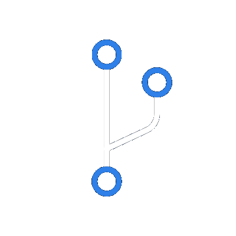

<h1 align="center">Hello, I'm Eduardo 😃</h1>

  <a href="https://www.linkedin.com/in/eduardo-h-o" target="_blank">
  
  
  </a>

<table border="0">
  <tbody>
    <tr>
      <td>
        
      </td>
      <td>
        <h4>I'm currently studying React, Next.js and Node.js.</h4>
      </td>
    </tr>
  </tbody>
</table>

<table border="0">
  <tbody>
    <tr>
      <td>
        
      </td>
      <td>
        <h4>I love technology and my main hobby is to study about it.</h4>
      </td>
    </tr>
  </tbody>
</table>

<table border="0">
  <tbody>
    <tr>
      <td>
        
      </td>
      <td>
        <h4>I'm interresed in connecting to people and share knowledge.</h4>
      </td>
    </tr>
  </tbody>
</table>

<table border="0">
  <tbody>
    <tr>
      <td>
        
      </td>
      <td>
        <h4>You can browse through my repositories to see some of my projects.</h4>
      </td>
    </tr>
  </tbody>
</table>

 

