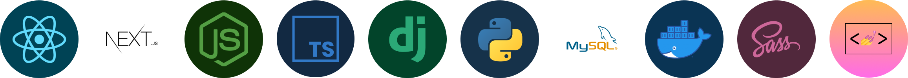

  
  <h1>Hello, I'm Eduardo 😃👋</h1>

  
  

## About me
I simply love technology and have the best time studing it, besides that, I also like playing video games, listening to music and working out. I'm very open to create new connections and share knowledge, if you want, you can contact me through my socials.

## Projects
I'm always creating new projects for hobby and to learn new things, you can browse through my repositories to see some of them, and if you like it, don't forget to give it a star 😉.

## Some of my skills

 

 

 
 

